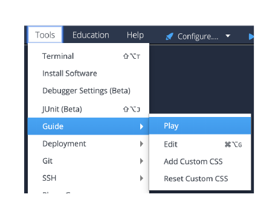

# Hello Codio in C++
This project shows you a sample lesson page in Codio and then explains how it was built. It then demonstrates Codio's auto-graded assessment capabilities.

Feel free to edit and try things out -- if you need a new copy of this project use one of the links below.

For Codio.com users, go to this [starter pack](https://codio.com/home/starter-packs/7fdfe1cc-315c-40a5-a68d-a6caae9adb5c).
For Codio.co.uk users, go to this [starter pack](https://codio.co.uk/home/starter-packs/e533f56a-f806-408b-8273-da83eb1f6e50).

## Start the Guide to see the project
If you are seeing this, you are currently in edit mode. To start Guides from this page, go to the tool bar at the top:

To view projects the way students do, press "Yes" when prompted to Start Guides.